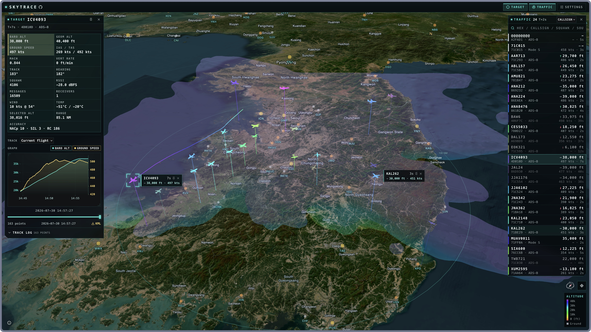
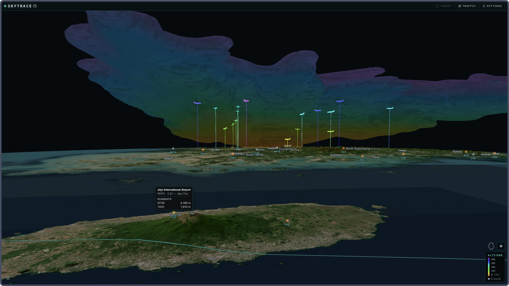

# Skytrace

Self-hosted 3D flight tracking for your ADS-B receiver.

Live demo: [sky.luftaquila.io](https://sky.luftaquila.io)

Inspired by [tar1090](https://github.com/wiedehopf/tar1090) and [ADS-B 3D](https://github.com/hook-365/adsb-3d).

## Features

- Live traffic, terrain and receiver coverage domes in 3D
- Aircraft details, charts and flight playback
- Worldwide airfields and runway details

<table>
  <tr>
    <th width="50%">Live 3D traffic, flight details and history</th>
    <th width="50%">3D terrain and receiver coverage dome</th>
  </tr>
  <tr>
    <td width="50%">
      <a href="docs/images/traffic-view.jpeg">
        
      </a>
    </td>
    <td width="50%">
      <a href="docs/images/coverage-dome.jpeg">
        
      </a>
    </td>
  </tr>
</table>

## Quick start

Set `RECEIVER_ID` to the ID you want to use for your receiver.

```sh
curl -fLo compose.yml https://raw.githubusercontent.com/luftaquila/skytrace/main/compose.yml
umask 077
RECEIVER_ID=receiver-01
printf 'SKYTRACE_RECEIVER_TOKENS={"%s":"%s"}\n' "$RECEIVER_ID" "$(openssl rand -hex 32)" > .env
docker compose up -d
```

Use `podman compose` instead of `docker compose` if preferred, then open <http://127.0.0.1:3000>.

See the [self-hosting guide](docs/self-hosting.md) for public access, backups and upgrades.

## Receiver agent

The receiver agent reads readsb-compatible `aircraft.json` from tar1090, ultrafeeder, dump1090-fa and readsb.

Linux builds are available for ARMv6, ARMv7, ARM64, AMD64 and RISC-V 64.

See the [setup guide](docs/receiver-agent.md) for details.

## Development

Requires Node.js 24 and Go 1.26.

Install dependencies and start the backend:

```sh
npm ci
npm --prefix web ci
npm run dev
```

In another terminal:

```sh
npm --prefix web run dev # Start the web app
```

Tests:

```sh
npx playwright install --with-deps chromium # Install Chromium and system dependencies
npm run check # Run the full test suite
```

## Data sources

- [OurAirports](https://ourairports.com/): airports and runways
- Esri World Imagery: satellite imagery
- [Mapterhorn](https://mapterhorn.com/): terrain
- [OpenFreeMap](https://openfreemap.org/): boundaries and place labels
- Community ADS-B aggregator: optional area traffic
